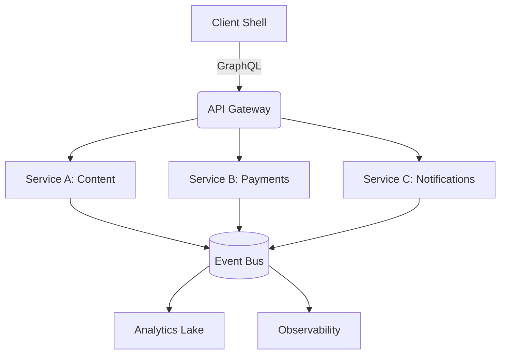

# Microservices Choreography & Experience Mesh

Even though the filename says "mobile", this pod captures how we stitch services, APIs, and progressive experiences together—mobile, desktop, or ambient.

## 1. Service Fabric Blueprint

- **API Gateway**: GraphQL Mesh + REST translator, typed via OpenAPI + Zod.
- **Event Bus**: Cloud-native (SNS + EventBridge) with outbox pattern for reliability.
- **Mobile/Edge Clients**: Consume via generated SDKs; fall back to stale-while-revalidate caches.

## 2. Choreography Principles

1. **Events > RPC** for cross-domain workflows (payments → notifications → analytics).
2. **Capability tokens** for mobile clients; avoid shipping raw service secrets.
3. **Progressive delivery**: use feature flags (GrowthBook) tied to SLO budgets.
4. **Schema drift guards**: CI checks compare GraphQL schema snapshots; mobile builds fail fast.

## 3. Progressive Experience Stack

- **React Native + Expo** for productivity mobile rituals.
- **PWA shell** for Thinki.sh/MetaLabs dashboards (offline journaling, caching).
- **n8n + Cloudflare Workers** for background automations triggered by mobile actions.

## 4. Reference Runbooks

| Scenario | Playbook |
| --- | --- |
| Rolling out a new service | Use the Service Fabric template repo, pick latency/error budgets, wire to OpenTelemetry collectors. |
| Launching a cross-platform feature | Start with PWA, add native wrappers only when hardware APIs are needed. |
| Handling outages | Trigger incident page (see `dev/observability.mdx`), run blameless retro referencing Incident Narratives template. |

## 5. Tooling Snapshot

- **Infrastructure**: Terraform + AWS CDK (TypeScript) for repeatable stacks.
- **Pipelines**: Buildkite + GitHub Actions with dependency graph caching.
- **Mobile Observability**: Sentry + Runway for release orchestration.

Use this document when you need a concrete blueprint for shipping mobile/web features that rely on a choreography of services and automations.
